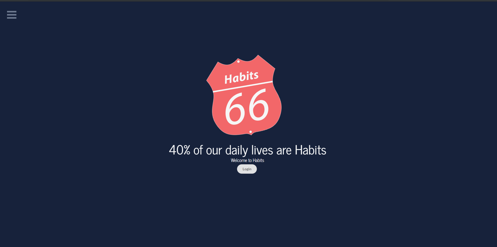

# Habits*66*

## Habit 21 is a full stack MERN (MongoDB, Express, React, Node.js) application.

Habit Tracker helps you learn the most effective process, increase self-awareness and set priorities so achieving your goals is easier than ever. It is a tool that enables you to build good habits by tracking them. Habits shape your life! 40 percent of your actions are not conscious decisions but habits. So habits are a big part of your life - and a lot of the time you don’t even notice it!

Interesting facts about Habits

- Your life is to a large extent the sum of all your habits – good or bad.
- You can take control of your life by changing your habits.
- Habits never truly disappear. They are just overpowered by other habits.

View a live example here: https://habits-sixtysix.herokuapp.com




### <a name="project-structure"></a> Structure of the project

After you clone the repository from GitHub, you can navigate to the <b>client</b> directory. The project directory structure will be set up as follows:

* <b>public</b>: The public folder contains the main index.html file. This HTML file contains a div with an id of root, which is the entry point to the app. This site uses a React component-based architecture to create, build, and render UI components.
* <b>src</b>: The src folder is where the React components reside.
  * <b>App.js</b>: The App.js file is where the components are imported and rendered, such as the top navigation bar, footer, and various page routes.
  * <b>index.js</b>: The index.js file is the top level file of the React app. In index.js, the App.js file is imported, and the ReactDOM.render method is used to render App.js.
  * <b>components</b>: The components folder is where the components that are reused across the app are located. Each file represents a separate component. For example, NavBar is the top navigation bar component that can be reused across the entire app for a consistent look and feel on each page. Each component also has their own, separate css.
* <b>App.css</b> and <b>index.css</b>: The external css stylesheets for the app.
* <b>.gitignore</b>: Anything listed inside this file (for example, node_modules) will not be tracked by GitHub when code is committed and pushed.
* <b>package.json</b>: Lists the project dependencies and their version numbers.
* <b>package-lock.json</b>: Dependency tree for the project. Lists all the dependencies and their versions.

## <a name="technologies-used"></a> Technologies used to create app

* HTML5
* CSS
* Javascript (ES6)
* [React](https://reactjs.org/)
* [Material UI](https://material-ui.com/)
* Express
* MongoDB
* CanvasJS (https://canvasjs.com/javascript-charts/)
* React Bootstrap (https://react-bootstrap.github.io/)


## Getting Started

These instructions will get you a copy of the project up and running on your local machine for development and testing purposes.

### Installing

Clone the repo
```
$ git clone https://github.com/Mhr85/project3_dev.git

```

The following packages are dependencies to the project.

* [@material-ui/core](https://www.npmjs.com/package/@material-ui/core)
  * This is a third party design library of React components that implement Google's Material Design.
* [@material-ui/icons](https://www.npmjs.com/package/@material-ui/icons)
  * This is a library of Material Design icons.
* [prop-types](https://www.npmjs.com/package/prop-types)
  * This is used to document and validate the different properties passed to a component.
* [react](https://www.npmjs.com/package/react)
  * This package contains the functionality necessary to define React components.
* [react-dom](https://www.npmjs.com/package/react-dom)
  * This serves as the entry point of the DOM-related rendering paths.
* [react-router-dom](https://www.npmjs.com/package/react-router-dom)
  * This is a third party routing library use to connect and link different components across the app.
* [react-scripts](https://www.npmjs.com/package/react-scripts)
  * This includes scripts and configuration used by Create React App.
Install dependencies

```
$ npm i

```

Run the app

```
$ npm start

```
Runs the app in the development mode.
Open http://localhost:3000 to view it in the browser.

The page will reload if you make edits.
You will also see any lint errors in the console.

### `npm test`

Launches the test runner in the interactive watch mode.<br>
See the section about [running tests](https://facebook.github.io/create-react-app/docs/running-tests) for more information.

### `npm run build`

Builds the app for production to the `build` folder.<br>
It correctly bundles React in production mode and optimizes the build for the best performance.

The build is minified and the filenames include the hashes.<br>
Your app is ready to be deployed!

See the section about [deployment](https://facebook.github.io/create-react-app/docs/deployment) for more information.
